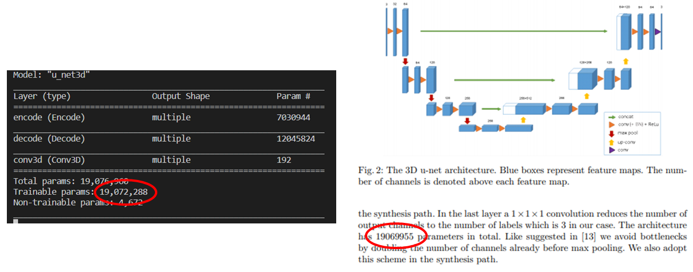

# 3D U-Net

This repository tries to follow the architecure of Özgün Çiçek et al. [3D U-Net: Learning Dense Volumetric Segmentation from Sparse Annotation](https://arxiv.org/abs/1606.06650) as closely as possible. As seen in the below figure, the number of parameters in this implementation is very similar to those reported in the paper but not exactly the same. I think this difference may be due to the counting of the batch normalisation parameters. 

There has been no attempt to optimise the performance of this architecture. However, a concise, modular, class-based implementation of the 3D U-Net is provided and as such it is probably more suited as a learning/teaching resource.